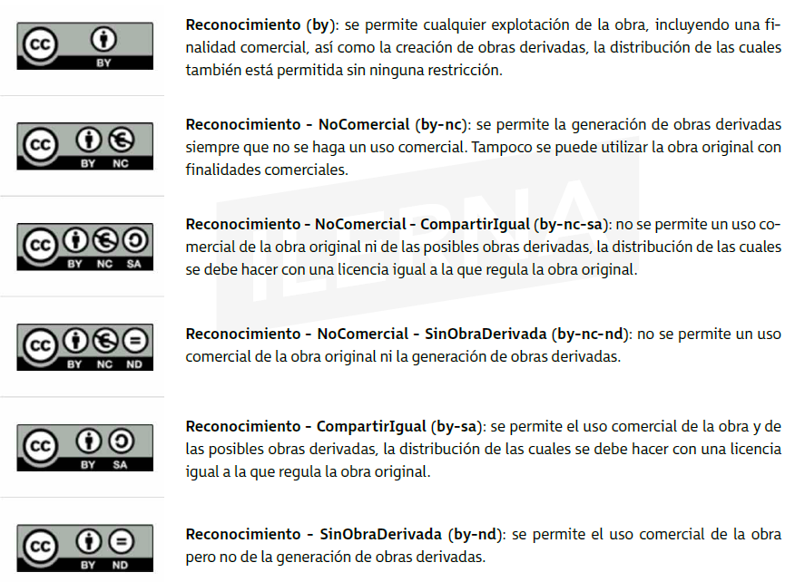

import EtiquetaPost from '../../components/EtiquetaPost.astro';

<EtiquetaPost curso = "DAW" asignatura = "Desarrollo de Interfaces Web"/>

## Tema 3.- Preparación e implementación de contenido multimedia

### 3.1. Tipo de imágenes en la web

Una decisión importante es elegir el formato de imagen que utilizaremos para que haya una buena relación entre la calidad y peso en bytes. Existen **tres tipos**: el mapa de bits, imágenes vectoriales y las imágenes animadas.

Los **mapas de bits** también llamadas **imágenes rasterizadas** (consistente en procesar imágenes en formato vectorial para convertirlas en mapas de bits), **imágenes matriciales** (se disponen en líneas horizontales y verticales formando un rectángulo) o **bitmap** (representación binaria). Están constituidas por píxeles y, si ampliamos la imagen, comprobaremos que pierden calidad porque los píxeles siguen siendo los mismos. El tamaño va a depender del tamaño de la imagen y servirán para representar fotografías e ilustraciones. Se identifican por sus extensiones: .gif, .jpg y .png.

Las **imágenes vectoriales** se construyen a través de funciones matemáticas que representan objetos geométricos, segmentos, arcos, etc.. Si ampliamos la imagen **no pierde calidad**. No habrá relación entre el tamaño de la imagen y el del archivo, por lo general ocuparán menos que los mapas de bits. Su uso será para dibujos, esquemas y planos.

### 3.2. Derechos de la propiedad intelectual. Licencias. Derechos de autor

Con el fin de proteger la creatividad humana, se ofrecen a los autores recompensas económicas equitativas e incentivos en forma de reconocimientos, estos son conocidos como derechos de *propiedad intelectual* y de *autor*. Este sistema evita que se realicen copias no autorizadas.

El alcance de ambos derechos, es diferente. La propiedad intelectual abarca tanto los derechos de autor como los conexos a esos derechos. Son facultades de otros agentes que han intervenido en la creación de una obra.

#### Derechos de la propiedad intelectual

Se dividen en dos grupos:

+ **Los derechos morales:** son los reconocidos para un/a autor/a y los/as artistas-intérpretes. Son irrenunciables y acompañan al autor durante toda su vida, incluso a sus herederos por causa de fallecimiento. Destaca el reconocimiento del autor de la obra y del artista sobre sus interpretaciones o ejecuciones, incluyendo el respeto a la integridad de la obra o actuación y a la no alteración de estas.
+ **Derechos de carácter económico:** es posible distinguir entre:
  
  + **Derechos exclusivos:** son aquellos que permiten al autor prohibir los actos de explatación de su propia obra o prestación protegida por el usuario, y poder exigir una retribución a cambio de la autorización de la obra.

  + **Derechos de remuneración:** estos no autorizan a su autor a prohibir los actos de explotación o prestación de su obra, aunque sí obligan al pago de una cantidad dineraria por los actos de explotación que se realicen, cuya contidad está determinada por la ley o por las tarifas generales de las entidades de gestión.
+ **Derechos compensatorios:** Es el derecho por copia privada que es compensada con los derechos de propiedad intelectual dejados de percibir por una razón de reproducción de obras o prestaciones protegidas para el uso exclusivamente privado del copista.

#### Licencias

Una licencia de software es un contrato entre el autor de los derechos de explotación y distribución y el usuario o consumidor para permitir utilizar el software cumpliendo una serie de términos y condiciones que se han establecido dentro de sus cláusulas.

Permiten establecer la cesión de derechos al usuario final sobre una o vaias copias del programa o límites en la responsabilidad por fallos u otros compromisos como la cesión del programa a terceros o la no reinstalación del mismo en diferentes dispositivos.

Para designar los derechos sin hacer relación a los derechos morales se utiliza *copyright*. Se utiliza el símbolo seguido de un nombre para indicar la titularidad de los derechos de explotación. Suele ir acompañado de "todos los derechos reservados".

El *copyleft* es una alternativa que aboga por el uso de lincencias libres que permiten compartir y reutilizar obras de creación. Hay varios tipos de licencias, las más utilizadas son las Creative Commons, o las Coloriuris.

No confundir *Creative Commons* con *copyleft* o *"todo libre"*, ya que la finalidad es un paso intermedio entre copyright y "libre total". Creative Commons pone a disposición de los autores las licencias, las cuales se incorporan en los lugares donde esté dicha obra. Esto permite que su obra pase a dominio público. En Creative Commons  el autor otorga mayor libertad de uso sobre su obra, aunque en determinadas condiciones.

+ **Reconocimiento:** el creador permite copiar, distribuir y comunicar públicamente su obra siempre y cuando se reconozca y cite al autor original.
+ **No comercial:** permite copiar, distribuir y comunicar públicamente la obra siempre y cuando no se utilice para fines comerciales.
+ **Prohibición de obras derivadas:** el creador permite copiar, distribuir y comunicar públicamente copias inalteradas de la obra, pero no permite realizar trabajos sobre ellas.
+ **Redistribución bajo la misma licencia:** permite la distribución de otras obras derivadas bajo una licencia idéntica a la que rige en la obra original.



#### Derechos de autor

Pueden ser:

+ **Derechos morales, irrenuncialbes,** como es el derecho de reconocimiento y el derecho de integridad de la obra.
+ **Derechos económicos, transferibles** y de una **duración limitada** en el tiempo, básicamente los derechos de explotación.

*Autor* se considera a la persona que aparece como tal en la obra. En las que han colaborado varios autores, pertenecen a todos aunque en las colectivas corresponde a la persona bajo cuya iniciativa y coordinación se edita y divulga la obra.


### 3.3. Imágenes: Mapa de bits, imagen vectorial. Formatos de imágenes

+ **GIF:** formato usado para imágenes sencillas, con forma simple y con pocos colores. Se caracteriza por:

  + Número de colores: 2 a 256 de una paleta de 24 bits.

  + Formato de compresión sin pérdida basado en LZW.

  + Carga progresiva en navegador.

  + Máscara de transparencia de 1 bit.

  + Permite animación simple.
+ **JPEG:** formato usado para comprimir imágenes fotográficas, ya que el ser humano no es capaz de percibir toda la información almacenada en una imagen de 24 bits. Por eso decimos que es un formato con pérdida. Las características son:

  + Número de colores: 24 bits color o 8 bits B/N.

  + Gran posibilidad de compresión.

  + Formato de compresión con pérdida.

  + No permite transparencias ni animaciones.
+ **PNG:** formato adecuado para imágenes renderizadas. Ofrece unos degradados suaves y una buena definición de líneas. Es un formato de compresión sin pérdida. Las principales características son:

  + Color indexado hasta 256 colores y TrueColor hasta 48 bits por píxel.

  + 10% más de compresión que GIF.

  + Compresión sin pérdida.

  + Canal alfa (transparencia variables).

  + No permite animaciones.

Este tipo ofrecen dificultades al intentar realizar modificaciones sobre la original o redimensionarla, ya que se redimensionarán los píxeles, haciendo que pierdan calidad y definición.

Estas limitaciones desaparecen con el **formato vectorial**. Posee dos grandes ventajas: una es la posibilidad de diseño posterior y otra que el tamaño de los archivos será mucho menor.

Existen dos tipos de imágenes vectoriales:
+ Las que necesitan de un plugin para poder verse en un navegador.
+ Las que se basan en lenguaje de marcado, cuyos elementos serán definidos mediante texto para que luego sea interpretado por el navegador.

Los formatos más populares en este tipo de imagen son: .eps, .ps, pdf, .fla, .swf, .wmf y .svg.

Para incluir una imagen debemos hacerlo con la etiqueta img, sus atributos son:

+ **src:** es obligatorio, indica la dirección URL de la imágen que queremos mostrar.
+ **alt:** texto alternativo en una imagen.
+ **width/height:** tamaño de la imagen. Es recomendable ponerlo para aligerar la carga.
+ **usemap:** si existe, indicará la información del mapa asociado y se convertirá en el nombre del mapa.
+ **ismap:** si la imagen se encuentra dentro de un enlace y es un mapa se indicará con este parámetro booleano.

Ejemplo:
```html

```

### 3.4. Software para crear y procesar imágenes

Tenemos herreamientas para el tratamiento de imágenes, tanto su creación como su modificación. Algunas para ejecutar de forma online o aplicaciones ejecutables desde nuestro equipo.

+ La más conocida es *Adobe Photoshop*. Sus funciones son la creación, edición y retoque de imágenes cuyos formatos propios son PSD y PDD, los cuales guardan capas, canales, guías y modos de color. Además, es capaz de utilizar distintos formatos más comunes.
+ Otra similar pero de software libre y gratuita, es *GIMP*.

Entre las herramientas online:

+ **Pixlr:** aplicación de uso sencillo y que presenta las herramientas básicas para el tratamiento de imágenes. Tiene menor potencia que los anteriores, pero su uso es más fácil.
+ **Cellsea Free Web Photo Editor:** software completo. Tiene casi las mismas funciones que Photoshop.
+ **Fauxto:** aplicación cuya interfaz de usuario se asemeja a Photoshop y también posee las herramientas de capas y filtros. Su usabilidad es más compleja que la herramienta anterior, Cellsea.
+ **ImageTool:** herramienta básica para la creación de logos. Solo es necesario elegrir el color de fondo y el texto para la creación del logo.


### 3.5. Optimización de imágenes para la web

Para crear un sitio debemos tener en cuenta los usuarios, las distintas conexiones y los dispositivos que utilizan. Debemos crear y añadir imágenes que ocupen el menor tamaño posible para que así su descarga y visualización se realice de forma ágil.

Para determinar el tamaño de un archivo gráfico:

+ Dimensiones de la imagen.
+ Profundidad o paleta de colores.
+ Resolución.
+ Formato de archivo.

#### Recomendaciones para realizar la optimización

No es recomendable usar resoluciones mayores de **96ppp (resolución 1600x1200)**.

Si reducimos el número de colores de la paleta, también reduciremos el tamaño del archivo.

Antes de insertar una imagen, conviene redimensionarla con algún programa de tratamiento de imágenes.

Conviene guardar los originales en **formato BMP, TIFF o JPEG sin realizar compresión y realizar copias en otros formatos con los que podadamos tratarlas.

Si queremos usar un dibujo, logotipo o gráfico, podemos usar GIF, ya que presenta colores más sólidos y una paleta más reducida.

El principio fundamental de una imagen en la web es que pese poco y se vea bien.

#### Herramientas para la optimización

Algunas pueden ser:

+ **Image Optimization:** herramienta online en la que podremos cargar un mapa de bits y optimizarla para usarla en la web sin perder calidad.
+ **DoSize:** posibilidad de cambiar el tamaño de una imagen y adecuarlo a las necesidades del diseñador.


### 3.6. Software para manipular audio y vídeo

#### Audio. Insertar audio en una web

##### Formatos

El formato de audio más popular es el **MP3**. Es un formato que usa un algoritmo con pérdida para conseguir un  menor tamaño del archivo en cuestión. Se usa en multitud de dispositivos y puede comprimirse usando una mayor o menor tasa de bits, teniendo así mayor o menor calidad de audio.

No es el único que existe, algunos con mejores prestaciones pero no todos los navegadores los soportan.

En el ámbito de los archivos comprimidos, debemos **diferenciar entre formato y códec**. El formato es la estructura de ese archivo, y el códec es el tipo de compresión que se ha utilizado. Para este tipo de archivos será necesario el códec correspondiente si queremos reproducirlo para que pueda ser descodificado.

Los más conocidos:

+ **OGG:** sirve para audio y vídeo. Es libre de patentes y está abierto, tiene un alto grado de eficiencia en *streaming* y en comprensión de archivos. Firefox y Chrome soportan .ogg.
+ **Real Audio:** es el formato por excelencia del *streaming*. La mayoría de páginas usan este formato. La empresa creadora es RealNetworks y el reproductor que han creado es RealPlayer.
+ **Windows Media Audio (WMA):** está desarrollado por Microsoft, posee una alta calidad de sonido y un tamaño reducido. Se pueden incluir derechos de autor. Puede ser un formato adecuado para *streaming*. Windows Media Player es capaz de reproducir este formato y el navegador IExplorer también es capaz de reproducirlo, pero no se puede asegurar en el resto.
+ **WAV** o **WAVE:** se usa sin compresión de datos. Los propietarios son Microsoft e IBM. Es conocido, pero se usa poco debido al gran espacio que ocupa.
+ **VQF:** desarrollado por Yamaha y es mejor que el MP3, pues tiene mejor calidad de sonido y menor tamaño. Su reproductor el Yamaha SoundVQ. No es muy extendido y requiere muchos recursos.

##### Conversión de formatos

Algunas herramientas para convertir son:

+ **Free Studio:** es capaz de convertir vídeo, audio o imagen. Tiene un fácil manejo y es adecuada para los diseñadores que trabajan con audio en la web. Tiene solo versión para Windows.
+ **Audacity:** es más avanzada para grabar y editar. Es libre y de código abierto. Presenta muchas funcionalidades, además de poder convertir los archivos. Podremos crear nuestros propios sonidos. Posee una versión para Linux y Windows.

También existen muchas páginas que son capaces de convertir archivos en distintos formatos. Ejemplo Switchr.

##### Cómo insertar un audio en una web

1. **Audio de fondo (HTML4):** no es muy recomendable usar un sonido de fondo usando etiquetas HTML, pero existen dos formas para hacerlo:
  + **bgsound:** esta etiqueta solo funciona con IExplorer.
```html
<bgsound src=”audio/Musica.wma” loop=”5” volumen=”10” />
```
  Los atributos son: **src**, indica la ruta del audio; **loop**, inicia el audio el número de veces que indiquemos una vez que se termina; **delay**, retrasa el inicio del audio en segundos; **volumen**, intensidad del sonido, valores entre -10.000(más débil) y 0(más alto).
  + **embed:** con esta etiqueta podremos insertar *plugins* de audio y vídeo, aunque no está estandarizada, por lo que los navegadores reaccionarán de forma distinta ante ella.
```html
<embed src=”audio/Musica.mp3” height=”0” type=”audio/ mpeg” loop=”false” controller=”false” >
```
  Los atributos serán: **src**, indica la ruta del archivo; con los atributos **autostart** o **loop** indicamos si el archivo se reproduce automáticamente o en bucle, ambos con valores *true* o *false*; los atributos **width** o **height** indican el tamaño de la controladora de sonido, si no se especifica un valor, se abrirá con un tamaño adecuado; **controller**, indica si aparece la consola de controlador del reproductor; **type**, indica el tipo de fichero que usamos para poder ejecutar el *plugin* adecuado.

2. **Descargar audio por el usuario (HTML4):** es recomendable dar la opción de poder descargar el audio para que los pueda escuchar de forma local. Para ello, usaremos una etiqueta *a* con el atributo *href* de la siguiente forma:
```html
<a href=”audio/Musica.wma”>Descargar Música<a>
```

3. **Insertar sonido (HTML5):** antes de html5 la inclusión de sonido tenía muchos inconvenientes. Con este, es más sencillo y eficaz. Aún así dependerá del navegador que se utilice.

Para insertar, utilizamos la etiqueta *audio*. Los atributos:

+ **Autoplay:** se inicia automáticamente.
+ **Controls:** controles de reproducción visibles.
+ **Loop:** el audio se repetirá automáticamente cuando termine.
+ **Preload:** indica si se cargará el archivo con la página (**auto**, se carga al cargar la página; **meta**, solo carga metadatos; y **none** no hay precarga).
+ **Src:** URL del archivo.

HTML5 nos permitirá usar navegadores en dispositivos móviles como iPhone o basados en Android.

Una mejora de la etiqueta *audio* a través de la etiqueta *source*. La incluiremos dentro de *audio* y crearemos una por cada tipo de archivo que queramos incluir.

Los formatos MP3 se leerán bien en IExplorer, Chrome y Safari, mientras Firefox usaremos OGG. El navegador irá leyendo el archivo, cuando encuentre una etiqueta *source* que contenga un tipo de archivo que pueda leer; si no consigue leer la primera línea, pasará a la siguiente y así hasta que consiga un archivo leíble.
```html
<!DOCTYPE html>
<html>
  <head>
  </head>
  <body>
    <audio controls=”controls” preload=”auto”>
    <source src=”Prueba.mp3” type=”audio/mpeg” />
    <source src=”Prueba.ogg” type=”audio/ogg” /> El
    navegador no soporta el audio
    </audio>
  </body>
</html>
```

La **interoperabilidad** es una de las ventajas de la etiqueta *audio*, aunque también deberemos buscar soluciones para los casos en los que no sea capaz de leer el contenido.

Una solución posible es el uso de la etiqueta *object* dentro de *embed*, en la cual podremos insertar un reproductor Flash para aquellos navegadores que no sean capaces de soportar el código anterior.

También podremos aplicar un estilo CSS a las etiquetas *audio*.

Cabe destacar que el **uso de HTML5 facilita la inserción de audio en la web**, ya que no requiere de plugins.

Para personalizar el reproductor, podemos usar Javascript y HTML5.

##### Consideraciones para el uso de audio en un sitio web

+ El audio se usa como contenido en dicha web.
+ Se usará como elemento decorativo (música de fondo).

En el primer caso, su uso se hace imprescindible. Para el segundo, cabe destacar que es una técnica en desuso. Si lo hacemos, debemos mostrar botones de reproducción para poder iniciar y parar la música cuando el usuario así lo desee.

Los archivos de audio solo deben utilizarse cuando sea imprescindible, ya que ocupan mucho tamaño, y optimizando su reproducción.

#### Vídeo. Insertar vídeo en una web

##### Formatos

Todo lo visto para los formatos de audio podemos extraporarlo a los formatos de vídeo. El uso de la **compresión en los vídeos** tiene más sentido debido al gran tamaño que tendrían de no estar comprimidos.

Relación de los tipos de formatos de vídeo que se pueden usar y sus respectivos códecs:

+ **.mp4:** contiene vídeo en formato MPEG-4, con los códec DivX, Xvid, QuickTime y H.264.
+ **.swf**, **.flv** y **.f4v:** versiones de Adobe para Flash vídeo desde 2002 hasta ahora. Códecs: Sorenson Spark, VP6 y H.264. El formato .f4v solo es capaz de soportar H.264.
+ **.ogg** y **.ogv:** contenedor *open source*.
+ **.mkv:** formato de vídeo en *open source* que puede contener casi cualquier formato de vídeo.
+ **.webm:** tipo de vídeo desarrollado por Google, en código abierto y con códec de audio Vorbis.
+ **.avi:** tipo más extendido, es soportado por varios dispsitivos, como *smartphones*, *tablets* e incluso televisión.
+ **.mov:** contenedor de QuickTime, propiedad de Apple. Casi idéntico a .mp4. Al ser propiedad de Apple, tendrá menos soporte en otras plataformas.

##### Conversión de formatos

Al igual que sucede con el audio, podemos convertir los distintos formatos de vídeo. También tenemos el mismo problema con los navegadores:**no existe un formato estándar**.

En HTML5, los formatos que más se usan tendrán los siguientes códecs de audio y vídeo:

+ MP4 = H.264(vídeo) y ACC(audio)
+ OGG y OGV = Theora(vídeo) y Vorbis(audio)
+ WEBM = VP8(vídeo) y Vorbis(audio)

Herramientas para la conversión:

+ **Miro Video Converter:** utilidad sencilla para convertir cualquier formato de vídeo, incluso OGV y WEBM
+ **FreeStudio:** es una potente herramienta que no solo trabaja en formatos de vídeo, sino que también con audio e imagen. Solo para Windows
+ **AtubeCatcher:** además de vídeo nos da la posibilidad de descargar vídeos desde distintos sitios web, como YouTube, Google Videos o Vimeo

##### Insertar vídeos en una web

En HTML5, disponemos de la etiqueta **video**, que tendrá los mismos atributos que tenía la etiqueta **audio**, y podemos ofrecer controles con Javascript.

La diferencia es que **para el vídeo necesitaremos asignarle un tamaño**, por lo que tendrá los atributos **height**(alto) y **width**(ancho).

```html
<video poster= “imagen/fondo.png” src=”misvideos/receta.
mp4” controls width=”460” height=”230”></video>
```

También podrá tener un atributo llamado **poster**, el cual un vídeo usará una imagen como portada antes de comenzar la reproducción.

En el ejemplo, algunos navegadores no serían capaces de reproducirlo. Podemos solucionarlo usando la etiqueta **source**. Al igual que con el audio solo es posible con HTML5 y utilizaremos la etiqueta **object**.

Podemos enlazar vídeos desde distintas webs, enlazandolos con la etiqueta **iframe**. También se podrán usar estilos CSS en las etiquetas de video.

### 3.7. Animación de imágenes y texto

Según Wikipedia, una animación es "un proceso utilizado para dar la sensación de movimiento a imágenes o dibujos. Los cuadros se pueden generar dibujando, pintando o fotografiando los minúsculos cambios hechos repetidamente a un modelo de la realidad o a un modelo tridimensional virtual".

Su uso principal es mostrar imágenes animadas en la web, como iconos y logotipos. Podemos utilizar varios formatos, GIF o SVG:

+ **SWF:** formato de archivo de gráficos vectoriales. Creado por Macromedia (Adobe Systems). Se emplea mucho debido a su pequeño tamaño y la gran interactividad de los usuarios. Contiene texto, audio, vídeo e imagen y, es capaz de reconocer gestos del ratón.
+ **MNG:** es un formato que está libre de derechos y es una extensión del formato de imagen PNG.

##### Elementos de una animación

Hay dos elementos que se complementan entre sí: los objetos gráficos y los elementos propios de la animación.

+ **Objetos gráficos:** representan cada uno de los fotogramas. Permanecerán inmóviles en cada uno de ellos. Se encargan de las características.
+ **Elementos propios de la animación:** representan cambios en los objetos a lo largo de los fotogramas. Se encargan del diseño.

##### Herramientas de programación

Nos centraremos en las dos que más se utilizan:

1. **HTML y Javascript**
  El HTML dinámico permite crear animaciones al combinarlo con Javascript.
  **JQuery** es una biblioteca de Javascript de software libre y código abierto que permite ahorrar tiempo y espacio al desarrollar nuestras animaciones, así podmos simplificar la manera de interactuar con documentos HTML.

2. **HTML5, CSS3 y Javascript**
  Las animaciones con Flash han perdido popularidad debido al problema de implementación en varias plataformas, lo que ha originado la aparición de este conjunto(HTML + CSS + Javascript).
  Javascript permite animaciones potentes y emplearlas en multitud de plataformas.
  Para no tener que escribir todo el código, se proponen estas alternativas:
  + **Entornos gráficos:** crean animaciones visualmente y guardarlas en formato SWF, podemos generar el código HTML5 de dicha animación.
  + **Adobe Edge:** permite crear animaciones web y contenido interactivo. Posee una interfaz intuitiva y con claridad. Permite importar documentos y soporta formatos de imagen más conocidos. Posee gran cantidad de efectos. Disponible en Windows, Mac y no es gratuita.
  + **Hype:** es casi idéntica pero para Mac OSX. No es gratuita.
  + **Sencha:** crea animaciones en CSS3, disponible en varios sistemas operativos pero no es gratuita.

##### Aplicaciones de conversión de archivos Flash

Ya que Flash no puede verse en muchos navegadores actuales podemos convertirlos con:

+ **Wallaby:** de Adobe que convierte .fla en HTML5.
+ **Swiffy:** de Google, gratuita que convierte de .swf a HTML5.

##### Animación de imágenes

Flash permite realizar dos tipos de animaciones: **fotograma a fotograma** y por **interpolación de fotogramas**.

En la primera cada fotograma sufre un pequeño cambio o variación con respecto al anterior. Para ello debemos crear un fotograma clave e ir copiando el fotograma y aplicar los cambios que deseemos en el nuevo fotograma.

En la **interpolación**, que esta pensada para animaciones sencillas, necesitaremos dos fotogramas clave distintos, uno para el inicio y otro para el final. La interpolación se encargara de realizar todos los fotogramas intermedios. Existen dos tipos:

+ **De forma:** transforma un objeto en otro. No pueden formar parte de un grupo.
+ **De movimiento:** cambia un objeto de posición, tamaño o rotación. Se puede realizar tanto con objetos agrupados como con símbolos.

##### Animación de texto

En flash tendremos **dos motores de texto:**

+ **Texto clásico:** única versión de texto hasta la llegada de la nueva versión CS5 de Flash.
+ **Texto TLF:** se incorpora en la nueva versión CS5, incluyendo mejoras respecto a la versión anterior.

**Características:**

+ **Posición:** valores X e Y que van a corresponder con el espacio desde la esquina superior izquierda del objeto de texto hasta la esquina superior izquierda del escenario.
+ **Tamaño:** valores de alto y ancho que tendrá la caja de texto medida en píxeles.
+ **Carácter:** son valores como la fuente, estilo, tamaño, color, espaciado o interlineado.
+ **Párrafo:** son valores como la alineación del párrafo, sangría de primera línea o márgenes.

### 3.8. Integración de audio y vídeo en una animación

#### Integración de audio

Los formatos de audio más utilizados en animaciones flash son WAV y MP3.

Para integrar el sonido:

1. Dos formas: arrastrando el archivo a la biblioteca o seleccionándolo en el menú Archivo > Importar > Importar a la biblioteca.
2. Después debemos crear una capa para ese archivo. Si son varios tendremos que crear una capa para cada uno.
3. Crearemos un fotograma clave en blanco para arrastrar el archivo a la escena en ese fotograma.

Si tenemos varios archivos deberemos crear el siguiente fotograma clave cuando terminel el anterior para que no se superpongan.

Tenemos opciones de sincronización:

+ **Sincronismo de tipo _Evento_:** el sonido se reproducirá de forma automática y hasta el final. Se pueden producir solapamientos de sonido.
+ **Sincronismo de tipo _Inicio_:** es casi idéntico al anterior, solo que evita la duplicidad del sonido.
+ **Sincronismo de tipo _Detener_:** impide que el sonido se reproduzca más allá del fotograma que indiquemos.
+ **Sincronismo de tipo _Flujo_:** el archivo de sonido se irá descargando de internet conforme se va reproduciendo la animación.

#### Integración de vídeo

Los formatos más utilizados son **FLV** y **F4V**.

Al igual que el audio hay que importarlo a la biblioteca, Archivo > Importar > Importar vídeo.

Si está en una dirección remota, se indica la ruta. Si es local lo haremos con un componente de reproducción o directamente en le línea de tiempo.

Nos pedirá que elijamos entre una lista de formatos de reproductores. A continuación se creará un componente Flash Vídeo en el escenario, que debemos configurar para reproducirlo localmente.

Si cogemos la segunda opción, nos dará tres alternativas para su inserción: vídeo incorporado, clip de película y gráfico.


### 3.9. Guía de estilos

El diseño gráfico abarca la **tipografía**, **colores** y **espacios** en el sitio web. Los manuales se centran en los aspectos técnicos y visuales de la publicación, el texto y el uso correcto de la lengua, gramática y ortografía, sobre todo en la estética. La aplicación de reglas de este manual proporciona uniformidad al aspecto visual de un documento.

La guía esta dirigida al departamento de diseño y desarrollo. Recoge los aspectos del diseño y sirve de guía para futuros empleados. Ayuda a tomar decisiones en cualquier fase de la creación y mantenimiento del sitio web.

Podemos encontrar características de las fotografías, logos, imágenes, colores, combinaciones de colores, iconos, tipos de letra y otros aspectos de la maquetación web.