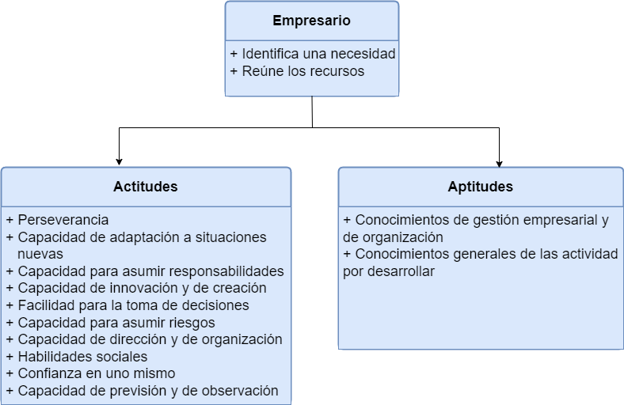

import EtiquetaPost from '../../components/EtiquetaPost.astro';

<EtiquetaPost curso = "DAW" asignatura = "Empresa e Iniciativa emprendedora"/>

## Tema 1.- Iniciativa emprendedora

La **iniciativa emprendedora** es un proceso con el que los individuos materializan en actividades prácticas sus ideas y las oportunidades de innovación. Puede ser individual o colectivo, se da en un contexto social, cultural y económico determinado.

Hablamos de **actitud motivacional** en la que se reconoce una oportunidad y se lleva a la práctica. Así, se creará valor y éxito economico.

Podríamos decir que la iniciativa emprendedora se considera una actitud vital.

Es un factor clave para la creación de empleo, el crecimiento económico y la mejora de la competitividad. Ante cambios profundos a nivel social y económico, la creación empresrial es uno de los motores ocupacionales de los individuos.

La **cultura emprendedora** es el conjunto de habilidades, cualidades y conocimientos necesarios para sacar adelante un proyecto, una carrera profesional o un negocio propio. No es un hecho individual, sino un conjunto.

La persona con espíritu emprendedor tiene capacidad de innovar y voluntad de probar a hacer las cosas de modo diferente. Hay quien nace con estas cualidades, pero se puede fomentar y formar.

### 1.1. Innovación y desarrollo económico

La **innovación** es clave para el desarrollo económico de un país, es el motor. En las teorías clásicas la riqueza de una nación se basaba en la posesión de capital y recursos naturales. Ahora, la cultura emprendedora e innovadora, junto con una buena organización social, constituye la base de la riqueza de un país. Otros factores son, la formación de la población y las infraestructuras de transporte y telecomunicaciones.

El desarrollo no debe entenderse solo desde el punto de vista económico, sino también como una mejora de la calidad de vida. Desde el punto de vista del desarrollo integrado, que hace compatibles la competitividad económica (desarrollo económico), el bienestar social (desarrollo social) y la sostenibilidad ambiental (desarrollo sostenible).

La innovación es la creación e implementación de cambios importantes en los productos, en su producción, en la comercialización o en la organización de la empresa con la finalidad de obtener unos mejores resultados. Se utilizan nuevos conocimientos o se combinan conocimientos ya existentes con nuevas tecnologías.

Se diferencian tres clases de innovación: **de producto, de proceso y tecnológica.**

#### Innovación de producto

Innovar puede ser tanto crear un producto nuevo como introducir cambios o modificaciones importantes en uno existente, para que el público lo perciba como nuevo o distinto. Hay tres tipos diferentes de innovación:

+ **Innovación total:** se crea un producto único, sin comparación en el mercado. No hay otro igual. Sin duda, escasean este tipo innovaciones.
+ **Innovaciones que aportan algo nuevo al producto:** se mejora un producto que ya se encuentra en el mercado. El cliente, lo percibe como algo nuevo, ya que la mejora es sustanciosa. Este tipo de innovaciónes son las más habituales y frecuentes.
+ **Innovación que no aporta nada nuevo:** por definición consiste en añadir alguna novedad. La empresa entra en el mercado con un producto ya existente o fabricado. La innovación reside en la empresa que se ha decidido a producir y vender el producto, pero no se precibe por el gran público o en el producto.

#### Innovación de proceso

Lo nuevo no está en el producto, sino en la forma de hacerlo. Introduce una manera diferente de hacer las cosas, que puede ser tanto a nivel de producción como de comercialización y de gestión.

#### Innovación tecnológica

El conocimiento científico, con base en la investigación y la experimentación, se pone al servicio de la actividad de la empresa. Puede aplicarse tanto en la creación de un producto nuevo como en la mejora de los sistemas de producción, de gestión o de comercialización. Suele ir encaminada a abaratar costes de producción y a aumentar la eficacia y la productividad, pero también genra unos costes. Para introducir la innovación tecnológica, se recomienda adquirir patentes y licencias de marcas registradas, de servicios científicos y técnicos relacionados con la implantación de la innovación y comprar paquetes de software, maquinaria y equipos.

Para innovar, es importante la atención y la observación para asegurar qué, cómo, cuándo y dónde hacerlo. Tener un conocimiento del mercado y de las necesidades de los clientes. Conocer el contexto en el que queremos innovar y saber introducir la nueva idea, tanto cubriendo una necesidad del mercado o creando la propia necesidad para cubrirla.

### 1.5. El empresario. Actitudes y requisitos de la actividad empresarial

El **empresario** organiza y combina los diferentes factores productivos. Fija objetivos para la empresa y debe encargarse de alcanzarlos mediante la planificación, dirección y control de la actividad empresarial. Su labor consiste en detectar e identificar una necesidad, para reunir y organizar recursos y así satisfacerla.

Tres requisitos para el buen funcionamiento de la actividad empresarial:

+ Una idea válida.
+ Un capital inicial.
+ Unos conocimientos profesionales y de gestión.

Esto no es suficiente, el empresario debe tener una serie de cualidades personales o **actitudes**, parecidas lógicamente a las de una persona emprendedora:

+ Capacidad de asumir riesgos
+ Facilidad para la toma de decisiones
+ Capacidad para asumir las responsabilidades
+ Capacidad de innovación y creación
+ Capacidad de adaptación a situaciones nuevas
+ Capacidad de dirección y de organizarse
+ Capacidad de prevenir y observar
+ Habilidades sociales
+ Confianza en uno mismo
+ Perseverancia

En cuanto a **aptitudes**, es obvio que el empresario deberá tener conocimientos profundos de la actividad profesional que va a desarrollar, del negocio y del sector. También tendrá que poseer un buen conocimiento de organización y de gestión empresarial. Si está falto de estos conocimientos, puede suplirlo o solucionarlo con la contratación de personas especializadas, de servicios externos o mediante la búsqueda de socios.

> Los conceptos de aptitud y actitud pueden generar confusión. Teniendo en cuenta que la **aptitud** es la habilidad natural o talento, podemos distinguirla de la **actitud** como el temperamento para hacer frente a las diferentes situaciones. Ambos conceptos son complementarios, ya que una aptitud en bruto sin una buena actitud queda incompleta. El candidato perfecto tiene una aptitud que potencia con su actitud.

> La **aptitud** la podemos definir como "habilidad natural para adquirir cierto tipo de conocimientos o para desenvolverse adecuadamente en una materia". De lo que podemos deducir que, si es apta para desenvolverse en ciertos ámbitos, tendrá menos destreza para otros. Incluso aunque esos ámbitos sean cercanos. Por ejemplo, puede ser apta para tocar un instrumento pero no para cantar, o puede ser apta para actor de doblaje pero no para aparecer ante las cámaras.

Los **riesgos** son parte intrínseca del empresario. No puede entenderse la actividad empresarial sin la asunción de riesgos ya que, entre sus funciones, está la toma de decisiones y la organización de los recursos. La toma de decisiones siempre existe riesgo, sin embargo, hay formas medibles para calcular los riesgos, evaluando las posibles ganancias o pérdidas por cada decisión. Si existen varios escenarios de pérdida o duda ante una decisión el riesgo es mayor. La planificación también requiere tener en cuenta la magnitud de estos riesgos y las posibles soluciones a los mismos.

La asunción de riesgos económicos y personales es uno de los grandes **inconvenientes** de ser empresario. Sacrificio de todo el tiempo, incluyendo el de ocio, obligación de hacer de todo y de solucionar todos los problemas y necesidad de aprender continuamente. También existen muchas **ventajas** para el empresario: ser el propio jefe, creación de trabajo y riqueza, obtención de beneficio económico, satisfacción por el trabajo bien hecho, posibilidad de desarrollar libremente las propias iniciativas y obtención de prestigio social y reconocimiento profesional.

### 1.6. Objetivos personales vs. objetivos empresariales: misión, visión y valores de empresa

Los objetivos personales del emprendedor deben estar coordinados con los objetivos empresariales. Si solo piensa en sus objetivos personales sería contraproducente para la empresa. A tener en cuenta tres aspectos: la misión de la empresa, la visión y los valores.

#### Misión de la empresa

La misión de una empresa es el propósito principal, el gran objetivo, el motivo por el cual se desarrolla la empresa. Debe cumplir dos objetivos: debe representar la personalidad y la identidad de la empresa en la actualidad y, por otro lado, debe encarnar la que se desea alcanzar en el futuro de la empresa. La misión debe responder a la siguiente pregunta: ¿cómo es la empresa y cómo se va a desarrollar?

La misión se caracteriza por tres elementos: su actividad, capacidad y sus recursos. Esto quiere decir que no debe referirse al producto que vende sino al servicio que presta. Debe definir su identidad corporativa y sus objetivos respecto al cliente, para aportar valor. Todas las operaciones que realice la empresa deben seguir la guía de esta misión para aportar credebilidad y coherencia. Este enfoque hace que podamos identificar a los clientes potenciales y las oportunidades que tiene la empresa ante la diversificación de actividades y productos.

La misión puede ser amplia o estricta, en función del número de factores que prevé en su definición. La amplia contempla muchos factores y permite una mayor libertad a la hora del desarrollo empresarial. La estricta pevé pocos factores y permite un nivel de control importanet en su aplicación y desarrollo.

Para que sea efectiva, debe formularse a largo plazo y la dirección de la empresa debe estar comprometida totalmente en su definición y desarrollo. También debe ser creíble en su planteamiento y realista para su realización. Además, todos los miembros de la organización tienen que asumirla y su presencia tendrá que ser necesaria en todo momento.

#### Visión de la empresa

La visión de la empresa es la esencia del negocio, se refiere a aquello a lo que la empresa aspira a ser. Se concreta con el **propósito estratégico** de la empresa y sus características son:

+ Abordar la idea de éxito del negocio que se está efectuando
+ Conseguir una estabilidad a través de los años: este es el comienzo y el camino por seguir durante todo el proceso
+ Ser capaz de crear un compromiso entre todos los miembros que pertenezcan a la organización

La visión aumenta la motivación y el entusiasmo de todos los componentes de la organización, desarrolla el espíritu competitivo de la empresa, haciendo partícipes a todas las personas de los objetivos empresariales, y establece puntos clave de control y valoración de la actividad empresarial, fijando, a partir de estos, los caminos por seguir.

#### Los valores de la empresa

La ideología de una empresa se ve representada por sus valores, que deben ser desarrollados y resumidos por todos sus trabajadores, sobre todo por sus directivos. Los valores representan los juicios éticos basados en varias sistuaciones de la vida social y que son aprobados por casi toda la sociedad.

> Los elementos de la cultura corporativa de la empresa Ford son:
> + **Misión:** son una familia global, diversa, dedicada a fabricar productos excepcionales y proporcionar servicios.
> + **Visión:** convertirse en la principal compañia del mundo en productos y servicios para el automóvil.
> + **Valores:** hacer bien las cosas para su gente, su ambiente y la sociedad, pero poniendo en primer lugar al cliente.

Los valores de la empresa presentan las siguientes **características:**

+ Son dinámicos
+ Son aceptados por la mayoría
+ Deben aplicarse y no quedarse en un simple enunciado ético
+ Se necesitan para una mejora social y para el incremento de la convivencia pacífica
+ Deben ser aplicados y no quedarse en un solo enunciado ético

Y también cumplen las siguientes **funciones:**

+ Ayudan a aceptar la responsabilidad social de una empresa
+ Forman parte de la visión de la empresa y del refuerzo ético
+ Refuerzan la obligación de los directivos con los objetivos estratégicos planteados en le empresa
+ Eligen el sistema de organización más conveniente para la cultura de la empresa
+ Fomentan un sistema de motivación laboral equitativo y transparente y, a su vez, la formación continua de la plantilla para los trabajadores

Es necesario un proceso de reflexión y actuación por parte de los fundadores y los directivos para incorporar determinados valores en la empresa. Pasos a seguir:

+ Establecer los valores fundamentales de la empresa: se pueden resumir en respeto, responsabilidad, solidaridad, tolerancia y libertad. Además, se deben tener en cuenta otros valores económicos, como la eficiencia, la rentabilidad y la sostenibilidad.
+ Definir la escala de valores: los valores se deben jerarquizar para evitar determinados conflictos
+ Comunicar los valores a todos los miembros de la empresa: para que sean conscientes de su preponderancia y situación
+ Usar un plan para que las actitudes de la empresa, internas y externas, se correspondan con los valores definidos
+ Evaluar si las actitudes que se generan en la empresa están de acuerdo con los valores definidos

### 1.7. Imagen corporativa de la empresa: Funciones y relación con los objetivos empresariales

Podemos definir la **imagen corporativa** de una empresa como la imagen que, tanto la sociedad como el entorno, tienen hacia la organización. La imagen que proyecta al exterior y que está relacionada con la cultura empresarial.

La imagen ha cobrado una importancia fundamental en el ámbito empresarial y cada organización se esfuerza para posicionarse en el mercado a través de una imagen corporativa potente, que enganche y que atraiga al potencial consumidor. Generar riqueza de marca garantiza, o facilita, un buen número de ventas y, por este motivo, las empresas tratan de ofrecer una imagen de simpatía, de eficiencia, de liderazgo, etc.

La imagen corporativa de cualquier empresa se construye a partir de la **fuerza**. La fuerza es aquel que reúne todos los valores que se quieren transmitir al mercado y a los potenciales clientes. Son esenciales dos aspectos:

+ **Coherencia:** se tiene que ser coherente con el producto que se vende o con el servicio que se presta. La imagen de la empresa no puede diferir mucho de la del producto.
+ **Empatía:** toda empresa debe tratar de incorporar a su imagen corporativa y a su cultura empresarial todo aquellos valores y aspectos que preocupan al entorno.

Dos valores que incorporan las empresas hoy en día son la preocupación por desarrollar una sociedad mejor y la sostenibilidad medioambiental.

### 1.9. Las buenas prácticas empresariales

Podemos definir las buenas prácticas como las contribuciones sobresalientes para mejorar la sostenibilidad y la calidad de vida de nuestras ciudades y comunidades.

El objetivo fundamental de un empresario es conseguir beneficios económicos para su empresa. Sin embargo, no todo vale, aunque parezca factible, dada la competitividad, que para obtener beneficios se pueda hacer lo que haga falta o se pueda utilizar a los empleados de cualquier manera, lo cierto es que un emprendedor o empresario no puede seguir este camino.

Es tan importante obtener beneficios como la forma de conseguirlos. El empresario tiene que actuar bajo la consigna de las buenas prácticas empresariales y aplicar los principios de la ética empresarial. Estas prácticas suponen la realización, por parte de la empresa, de actuaciones que sean coherentes con los principios éticos fijados y que lleven a la aplicación efectiva de los mismos.

Aplicarán de forma práctica un conjunto de valores, de principios y de normas que constituyen la ética empresarial y así poder alcanzar una complicidad con la sociedad que les rodea y una adaptación a todos los entornos, pero siempre respetando los valores y los derechos reconocidos por la sociedad a la que se dirigen.

Tener un código ético de conducta, junto con un compromiso por parte de la empresa para cumplirlo, proporcionará una guía de cuáles son las buenas prácticas empresariales que la empresa deberá llevar a cabo.
